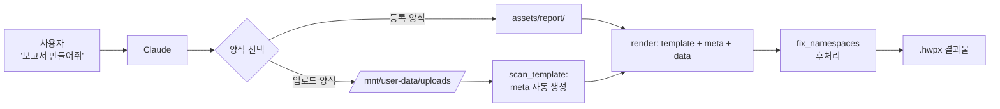

# hwpx-skill

> Claude를 위한 HWPX 한글 문서 생성 스킬. **양식(template) + 메타파일(meta.json)** 한 쌍만 갖춰두면 어떤 양식이든 한 줄의 `render()` 호출로 채워서 만든다.

이 스킬은 한국 학교·공공기관에서 매일 쓰는 한글 양식 문서(보고서, 공문, 안내문, 계획서 등)를 Claude에게 맡기기 위해 만들어졌다. 양식을 한 번 등록해두면 매번 처음부터 만들지 않고도 데이터만 바꿔 끼울 수 있다.

---

## 동작 방식



핵심: `render(template_dir, output, data)` 한 줄이면 모든 양식이 동일하게 처리된다.

---

## 핵심 아이디어

기존 방식의 문제: 양식이 바뀔 때마다 코드를 고치고, 양식이 늘어날 때마다 SKILL.md를 수정해야 한다.

이 스킬의 접근: **양식 옆에 자기 매핑 정보를 들고 다니는 메타파일을 둔다.** SKILL.md와 `render.py`는 어떤 양식이 와도 그대로다.

```
assets/
├── report/
│   ├── template.hwpx       # 양식 본체
│   └── template.meta.json  # 이 양식의 placeholder 명세
├── official-doc/           # (추가 양식)
│   ├── template.hwpx
│   └── template.meta.json
└── ...
```

새 양식 추가 = 폴더 하나 만들고 파일 두 개 넣기. 끝.

---

## 빠른 시작

### 1) 의존성 설치

```bash
pip install python-hwpx Pillow
```

`Pillow`는 `image_text` 필드(학교명을 로고 자리에 텍스트 이미지로 표시)를 사용할 때 필요합니다. 이 기능을 사용하지 않으면 `python-hwpx` 만 설치해도 됩니다.

### 2) 보고서 한 부 생성

```python
import sys
sys.path.insert(0, "scripts")
from render import render

render(
    template_dir="assets/report",
    output_path="output.hwpx",
    data={
        "기관명": "○○고등학교",
        "보고서_제목": "AI 활용 교사 연수 결과",
        "작성일": "today",                       # "today" / "2026-05-30" / date 객체 모두 가능
        "목차_1": ". 추진 배경",
        "목차_2": ". 추진 경과",
        "본문_1단계": [                          # 리스트 = 순차 치환
            "AI 도입 배경",
            "현장 적용 성과",
            "향후 계획",
        ],
    },
)
```

### 3) 결과 확인

`output.hwpx` 를 한컴오피스 한글에서 열어 확인한다.

---

## 결과물 미리보기 (텍스트)

`examples/example_official_doc.py` 를 실행하면 다음과 같은 공문서가 생성된다:

```
수신  경신고등학교장
(경유)
제목  2026학년도 AI 활용 교사 직무연수 안내

1. 관련: 교육정책과-1234(2026. 2. 1.)호
2. 2026학년도 교사 디지털 역량 강화를 위한 AI 활용 직무연수를
   아래와 같이 안내하오니 관심 있는 교원의 적극적인 참여 바랍니다.
  가. 일시: 2026. 5. 30.(토) 14:00~17:00
  나. 장소: 대구창의융합교육원 컴퓨터실
  다. 대상: 중등 교사 30명
  라. 내용: AI 활용 행정 업무 자동화 실습
    1) 사전 신청: 5월 25일까지 NEIS 직무연수 신청
    2) 필수 준비물: 노트북, 충전기

붙임  2026학년도 AI 활용 교사 직무연수 계획서 1부.  끝.
```

`examples/` 폴더의 다른 예시도 같은 방식으로 실행 가능하다.

---

## 디렉터리 구조

```
hwpx-skill/
├── SKILL.md                          # Claude가 읽는 스킬 명세 (양식 무관)
├── README.md                         # 이 파일
├── LICENSE
├── scripts/
│   ├── render.py                     # 단일 진입점 (양식 무관)
│   ├── scan_template.py              # 새 양식의 placeholder 자동 추출
│   ├── verify.py                     # 렌더 결과 검증
│   └── fix_namespaces.py             # HWPX 호환성 후처리 (자동 호출됨)
├── assets/
│   ├── report/                       # 내부 보고서 (4단계 □○―※ 위계)
│   ├── official-doc/                 # 공문서/기안문 (1.가.1) 위계)
│   ├── parent-notice/                # 학부모 안내문(가정통신문)
│   ├── plan/                         # 운영 계획서 (Ⅰ.Ⅱ.Ⅲ. 위계)
│   └── meeting-minutes/              # 회의록 (정보표 + 안건/논의/결정)
├── references/
│   ├── creating-new-template.md      # 새 양식 추가 가이드
│   ├── building-template-with-python.md  # 한컴오피스 없이 양식 만들기
│   ├── report-style.md               # 내부 보고서 양식 규약
│   ├── official-doc-style.md         # 공문서(기안문) 양식 규약
│   └── xml-internals.md              # HWPX XML 내부 구조
├── examples/
│   ├── example_report.py
│   ├── example_official_doc.py
│   ├── example_parent_notice.py
│   ├── example_plan.py
│   └── example_meeting_minutes.py
└── evals/
    └── evals.json                    # 스킬 평가 케이스
```

각 양식 폴더는 동일한 구조:
```
assets/<양식종류>/
├── template.hwpx           # 양식 본체
└── template.meta.json      # placeholder 명세
```

---

## Claude에서 스킬로 사용하기

Claude는 이 스킬을 자동으로 인식하여 사용자의 "한글 보고서 만들어줘" 같은 요청이 들어오면 호출한다.

### Claude.ai (Free / Pro / Max / Team / Enterprise)

공식 안내에 따르면 다음 단계를 거친다:

1. Claude.ai 좌측 메뉴에서 **Settings → Capabilities** 로 이동, **Code execution and file creation** 토글을 켠다 (이 스킬이 스크립트를 실행하기 때문에 필수).
2. **Customize → Skills** 로 이동.
3. 우측 상단의 "+" 버튼 → **Create skill** → **Upload a skill**.
4. 이 저장소를 ZIP으로 압축해서 업로드. (저장소 루트 폴더 전체를 압축, 폴더 안에 `SKILL.md`가 있는 구조)
5. 업로드된 스킬을 토글로 활성화.

이후 Claude와의 대화에서 "한글로 보고서 작성해줘" 같은 요청이 들어오면 스킬이 자동으로 트리거된다.

Team / Enterprise 플랜에서는 owner가 organization-wide로 provision 할 수 있다.

> 출처: [Use Skills in Claude (Claude Help Center)](https://support.claude.com/en/articles/12512180-use-skills-in-claude)

### Claude Code (beta)

Claude Code에서는 skill 폴더를 다음 경로에 두면 자동으로 인식된다:

- 전체 사용자용: `~/.claude/skills/<skill-name>/`
- 프로젝트 전용: `<project>/.claude/skills/<skill-name>/`

```bash
git clone https://github.com/<your-username>/hwpx-skill ~/.claude/skills/hwpx
```

### API (code execution tool 사용 시)

API 통합은 Anthropic 공식 문서의 code execution tool 가이드를 참고. 이 스킬은 SKILL.md 기반의 표준 구조를 따르므로 그대로 사용 가능하다.

---

## 양식 추가하기

1. 한글에서 양식을 만든다. 채워질 자리에는 **본문에 절대 나오지 않을 고유한 placeholder 텍스트**를 박아둔다.

2. placeholder 자동 추출:
   ```bash
   python scripts/scan_template.py my-template.hwpx -o template.meta.json
   ```

3. 생성된 `template.meta.json`의 `key`, `name`, `description`, `required` 를 의미 있게 채운다. `TODO_field_01` 같은 자동 생성 키를 사람이 이해할 수 있는 이름으로 바꾸는 게 핵심이다.

4. 폴더 구조에 배치:
   ```
   assets/
   └── <양식종류>/
       ├── template.hwpx
       └── template.meta.json
   ```

5. 테스트:
   ```python
   render("assets/<양식종류>", "test.hwpx", data={...})
   ```

자세한 절차와 디자인 원칙은 [`references/creating-new-template.md`](references/creating-new-template.md) 참고.

---

## 메타파일 스키마

```json
{
  "name": "양식 이름",
  "description": "양식 설명 (AI가 양식 선택 시 참고)",
  "fields": [
    {
      "key": "기관명",
      "placeholder": "양식에 박혀있는 원본 텍스트",
      "type": "single",
      "required": true,
      "description": "사람용 설명"
    },
    {
      "key": "작성일",
      "placeholder": "2024. 5. 23.",
      "type": "date",
      "format": "YYYY. M. D.",
      "default": "today"
    },
    {
      "key": "본문_1단계",
      "placeholder": "헤드라인M 폰트 16포인트(문단 위 15)",
      "type": "sequential",
      "max_count": 8
    }
  ]
}
```

| type | 동작 | data 형태 |
|---|---|---|
| `single` | placeholder 등장 위치 모두 같은 값으로 치환 | 문자열 |
| `sequential` | 등장 위치를 순서대로 다른 값으로 치환 | 리스트 |
| `date` | "today" / 문자열 / date 객체를 `format` 으로 변환 | 문자열/date/`"today"` |
| `image_text` | 텍스트를 PNG 이미지로 만들어 ZIP 내부 이미지를 교체 (학교명을 로고 자리에 표시할 때) | 문자열 |

---

## 양식 카탈로그

| 양식 | 폴더 | 용도 | 위계 체계 |
|---|---|---|---|
| 내부 보고서 | [`assets/report/`](assets/report/) | 학교·기관 내부 보고서, 추진계획서, 결과보고서 | □ ○ ― ※ (4단계) |
| 공문서(기안문) | [`assets/official-doc/`](assets/official-doc/) | 대외 공문, 기안문, 행정 공문 | 1. 가. 1) (표준) |
| 학부모 안내문 | [`assets/parent-notice/`](assets/parent-notice/) | 가정통신문, 학부모 대상 안내·협조 요청 | 1. 2. 3. (단순) |
| 운영 계획서 | [`assets/plan/`](assets/plan/) | 사업·프로그램 운영 계획, 학년도 운영 계획 | Ⅰ. Ⅱ. Ⅲ. (장 단위) |
| 회의록 | [`assets/meeting-minutes/`](assets/meeting-minutes/) | 학년부/부서/위원회 회의 기록 | 안건·논의·결정 (3섹션) |

> 양식 기여를 환영합니다. [`references/creating-new-template.md`](references/creating-new-template.md)의 절차를 따라 PR을 보내주세요.

> **참고**: `report` 양식을 제외한 나머지 4종은 python-hwpx로 생성된 **단순한 골격 양식**입니다. 한컴오피스에서 열어 학교 로고, 머리글/바닥글, 글꼴, 디자인을 보완하면 더 좋은 결과물이 됩니다. 학교에 이미 공식 양식이 있다면 그것을 업로드하여 `scripts/scan_template.py`로 처리하는 것이 가장 적합합니다.

---

## 자주 묻는 질문

**Q. 양식이 한컴오피스 한글에서 정상이지만 macOS 한컴 뷰어에서 빈 페이지로 나옵니다.**
A. 네임스페이스 후처리(`fix_namespaces.py`)가 빠진 경우입니다. `render()` 를 사용하면 자동 수행되지만, 직접 ZIP을 조작하는 경우 마지막에 명시적으로 호출해야 합니다.

**Q. `max_count` 보다 많은 본문 항목을 넣고 싶습니다.**
A. 양식 자체에 슬롯이 그 개수만 있어서 그렇습니다. 한글에서 양식을 열어 슬롯을 추가하거나, 그 다음 항목들은 한글에서 직접 입력하시는 게 빠릅니다.

**Q. 사용자 업로드 양식과 등록 양식 중 어느 게 우선인가요?**
A. 항상 사용자 업로드 양식이 우선입니다. `/mnt/user-data/uploads/` 에 `.hwpx`가 있으면 등록 양식을 무시하고 그것을 사용하도록 SKILL.md에 명시되어 있습니다.

**Q. 일반 Word(.docx) 문서도 만들 수 있나요?**
A. 이 스킬은 HWPX 전용입니다. Word는 별도의 `docx` 스킬을 사용하세요.

---

## 라이선스

코드: MIT License — [`LICENSE`](LICENSE) 참고.
양식 파일(`assets/**/template.hwpx`): 별도 명시가 없는 한 MIT.

이 프로젝트는 한컴(Hancom Inc.)과 무관하며, "HWPX"는 한컴의 상표입니다.

---

## 기여 (Contributing)

이슈와 PR을 환영합니다. 특히:

- 새 양식 추가 (학부모 안내문, 공문서, 회의록, 운영 계획서 등)
- placeholder 자동 감지 로직 개선 (`scan_template.py`)
- 다양한 한글 버전·환경에서의 호환성 테스트
- 다국어 문서 (영문 README 등)

PR 전에 `python examples/example_report.py` 가 정상 실행되는지 확인해주세요.

---

## 참고 자료

- [HWP/OWPML 형식 공식 다운로드 페이지 (한컴)](https://www.hancom.com/support/downloadCenter/hwpOwpml) — HWPX는 한국산업표준 KS X 6101의 OWPML 기반
- [HWPX 포맷 구조 살펴보기 (한컴테크 블로그)](https://tech.hancom.com/hwpxformat/)
- [Claude Skills 공식 문서](https://support.claude.com/en/articles/12512180-use-skills-in-claude)
- [python-hwpx (PyPI)](https://pypi.org/project/python-hwpx/)
